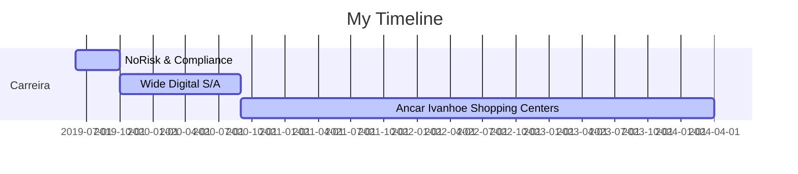

# Carlos

Carlos, um sonhador de altas conquistas, apaixonado pelo Vasco da Gama e o mundo de dados. Começando a escrever a minha história na área de Tecnologia, já desfrutei de experiências de Suporte e, agora vivienciando um novo momento como estudante de Ciências de dados e profissionalmente, como Analista de Dados com foco em Ciências de Dados.

Skills: Python / SQL / Estatística / Análise de Dados / Ciências de Dados / Machine Learning

 
   

